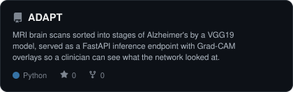
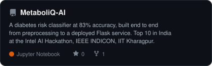
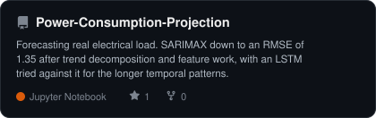
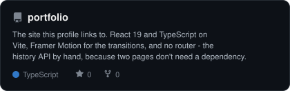
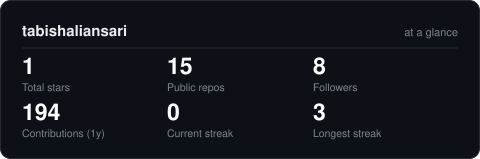

---

## 01 : About

I build data and AI systems end to end : the pipeline, the model, the API, and the thing
someone actually clicks. Most of my work sits at the seam between data engineering and product.

- **Currently** : Software Development Engineer at [NonStop io](https://nonstopio.com). Five PoCs shipped; now leading one product end to end.
- **Studied** : B.Tech in Artificial Intelligence & Data Science, AISSMS IOIT Pune, 2022–2026.
- **Competed** : Top 10 in India at the Intel AI Hackathon, IEEE INDICON, IIT Kharagpur. 1st runner-up at the Data Analytics Case Competition, ISB&M Pune.
- **Off the clock** : public speaking and tech talks, football, and a table tennis habit I can't shake.

## 02 : Toolbox

Twelve things, not thirty : this is the list I'd want to be asked about in an interview.

## 03 : Self-rated

Made up by me, on purpose. It's an opinion, not a measurement : the measured half of the
page is further down, in **06**.

<picture>
  <source media="(prefers-color-scheme: dark)"  srcset="assets/radar-dark.svg">
  <source media="(prefers-color-scheme: light)" srcset="assets/radar-light.svg">
  
</picture>

## 04 : The year in commits

<picture>
  <source media="(prefers-color-scheme: dark)"  srcset="assets/metrics.isocalendar-dark.svg">
  <source media="(prefers-color-scheme: light)" srcset="assets/metrics.isocalendar-light.svg">
  
</picture>

<picture>
  <source media="(prefers-color-scheme: dark)"  srcset="https://raw.githubusercontent.com/tabishaliansari/tabishaliansari/output/snake-dark.svg">
  <source media="(prefers-color-scheme: light)" srcset="https://raw.githubusercontent.com/tabishaliansari/tabishaliansari/output/snake.svg">
  
</picture>

## 05 : Selected work

<table>
<tr>
<td width="50%">
<a href="https://github.com/DA-workshop-101/Alzheimer-Stages-Classification-using-Deep-Learning">
<picture>
  <source media="(prefers-color-scheme: dark)"  srcset="assets/card-ADAPT-dark.svg">
  <source media="(prefers-color-scheme: light)" srcset="assets/card-ADAPT-light.svg">
  
</picture>
</a>
</td>
<td width="50%">
<a href="https://github.com/tabishaliansari/MetaboliQ-AI">
<picture>
  <source media="(prefers-color-scheme: dark)"  srcset="assets/card-MetaboliQ-AI-dark.svg">
  <source media="(prefers-color-scheme: light)" srcset="assets/card-MetaboliQ-AI-light.svg">
  
</picture>
</a>
</td>
</tr>
<tr>
<td width="50%">
<a href="https://github.com/tabishaliansari/Power-Consumption-Projection">
<picture>
  <source media="(prefers-color-scheme: dark)"  srcset="assets/card-Power-Consumption-Projection-dark.svg">
  <source media="(prefers-color-scheme: light)" srcset="assets/card-Power-Consumption-Projection-light.svg">
  
</picture>
</a>
</td>
<td width="50%">
<a href="https://github.com/Vibe-Coding-by-Tabish/tabish-portfolio">
<picture>
  <source media="(prefers-color-scheme: dark)"  srcset="assets/card-portfolio-dark.svg">
  <source media="(prefers-color-scheme: light)" srcset="assets/card-portfolio-light.svg">
  
</picture>
</a>
</td>
</tr>
</table>

| | Live | Walkthrough | Built with |
|---|---|---|---|
| **ADAPT** | [adapt-webapp-007.netlify.app](https://adapt-webapp-007.netlify.app/) | [YouTube](https://www.youtube.com/watch?v=U3JPrEf1Syo) | VGG19 · FastAPI · React · Cloud Run |
| **MetaboliQ-AI** | : | [YouTube](https://www.youtube.com/watch?v=sxvw4tzdTpY) | scikit-learn · Flask |
| **Power-Consumption-Projection** | : | [YouTube](https://www.youtube.com/watch?v=3m64id9M-rU) | SARIMAX · LSTM · Databricks · Supabase |
| **portfolio** | [tabishaliansari.vercel.app](https://tabishaliansari.vercel.app) | : | React 19 · TypeScript · Vite · Framer Motion |

## 06 : Measured

No opinions in this section : these come from the API.

<picture>
  <source media="(prefers-color-scheme: dark)"  srcset="assets/card-stats-dark.svg">
  <source media="(prefers-color-scheme: light)" srcset="assets/card-stats-light.svg">
  
</picture>

<picture>
  <source media="(prefers-color-scheme: dark)"  srcset="assets/metrics.achievements-dark.svg">
  <source media="(prefers-color-scheme: light)" srcset="assets/metrics.achievements-light.svg">
  
</picture>

---